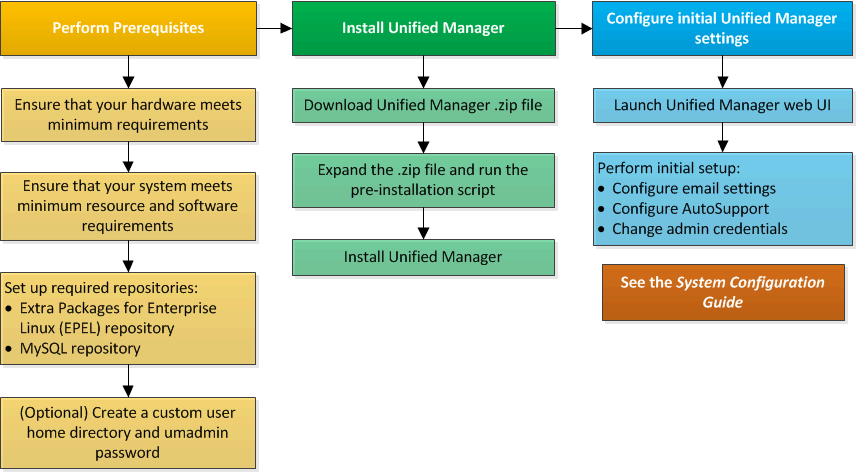

= Überblick über den Installationsprozess auf Red hat oder CentOS
:allow-uri-read: 
:icons: font
:imagesdir: ../media/

[role="lead"]
Im Installations-Workflow werden die Aufgaben beschrieben, die Sie vor der Verwendung von Unified Manager ausführen müssen.

