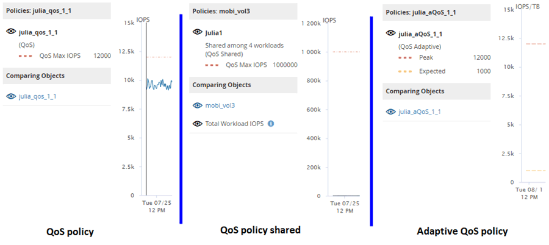

= Wie verschiedene Arten von QoS-Richtlinien in Unified Manager angezeigt werden
:allow-uri-read: 
:icons: font
:imagesdir: ../media/

[role="lead"]
Sie können die von ONTAP definierten Richtlinieneinstellungen für die Quality of Service (QoS) anzeigen, die auf ein Volume oder eine LUN angewendet wurden. Diese Einstellungen finden Sie in den Diagrammen zu IOPS/TB und MB/s im Performance Explorer. Die in den Diagrammen angezeigten Informationen unterscheiden sich je nach QoS-Richtlinie, die auf den Workload angewendet wurde.

Eine Einstellung für den Durchsatz „`ceiling`“ definiert den maximalen Durchsatz, den der Workload verbrauchen kann, und begrenzt somit die Auswirkungen auf konkurrierende Workloads für Systemressourcen. Durch eine Einstellung für den Durchsatz „`Boden`“ wird der Mindestdurchsatz definiert, der für den Workload verfügbar sein muss, damit ein wichtiger Workload die Mindestdurchsatz-Ziele erfüllt, unabhängig von der Nachfrage durch konkurrierende Workloads.

Gemeinsame und nicht gemeinsam genutzte QoS-Richtlinien für IOPS und MB/s definieren Boden und Decke mit den Begriffen „`minimum`“ und „`maximum`“. Adaptive QoS-Richtlinien für IOPS/TB, die mit ONTAP 9.3 eingeführt wurden, definieren Boden und Obergrenze mit den Begriffen „`erwarted`“ und „`Peak`“.

Mit ONTAP können Sie diese zwei Arten von QoS-Richtlinien erstellen, abhängig davon, wie sie auf Workloads angewendet werden, gibt es in den Performance-Diagrammen drei Arten, die QoS-Richtlinie angezeigt wird.

|===
| Art der Richtlinie | Funktionalität | Anzeige in der Unified Manager-Schnittstelle 

 a| 
QoS-Richtlinien für gemeinsame Workloads, die einem einzelnen Workload zugewiesen sind oder QoS-Richtlinien, die nicht gemeinsam genutzt werden, die einem einzelnen Workload oder mehreren Workloads zugewiesen sind
 a| 
Jeder Workload kann die angegebene Durchsatzeinstellung belegen
 a| 
Zeigt „`(QoS)`“ an.

 a| 
QoS-Richtlinien für gemeinsame Nutzung, die mehreren Workloads zugewiesen sind
 a| 
Alle Workloads teilen sich die angegebene Durchsatzeinstellung
 a| 
Zeigt „`(QoS Shared)`“ an.

 a| 
Anpassungsfähige QoS-Richtlinie, die einem einzelnen oder mehreren Workloads zugewiesen ist
 a| 
Jeder Workload kann die angegebene Durchsatzeinstellung belegen
 a| 
Zeigt „`(QoS Adaptive)`“ an

|===
Die folgende Abbildung zeigt ein Beispiel dafür, wie die drei Optionen in den Zählerdiagrammen angezeigt werden.

Wenn eine normale QoS-Richtlinie, die in IOPS definiert wurde, im IOPS/TB-Diagramm für einen Workload angezeigt wird, konvertiert ONTAP den IOPS-Wert in einen IOPS/TB-Wert, und Unified Manager zeigt diese Richtlinie im IOPS/TB-Diagramm zusammen mit dem Text „`QoS“, definiert in IOPS`“ an.

Wenn eine in IOPS/TB definierte anpassungsfähige QoS-Richtlinie im IOPS-Diagramm für einen Workload angezeigt wird, konvertiert ONTAP den IOPS/TB-Wert in einen IOPS-Wert und Unified Manager zeigt diese Richtlinie im IOPS-Diagramm zusammen mit dem Text „`QoS Adaptive, Definiert in IOPS/Used TB`" oder „`QoS Adaptive, definiert in IOPS/zugewiesenen TB`“, abhängig davon, wie die Einstellung für die IOPS-Spitzenzuweisung konfiguriert ist. Wenn die Zuweisungseinstellung auf „`Alered-space`“ festgelegt ist, wird der IOPS-Spitzenwert basierend auf der Größe des Volumes berechnet. Wenn die Zuweisungseinstellung auf „`used-space`“ festgelegt ist, wird die IOPS-Spitzenauslastung basierend auf der im Volume gespeicherten Datenmenge unter Berücksichtigung der Storage-Effizienz berechnet.

[NOTE]
====
Das IOPS/TB-Diagramm zeigt Performance-Daten nur dann an, wenn die logische Kapazität, die vom Volume verwendet wird, größer als oder gleich 1 TB ist. In der Tabelle werden Lücken angezeigt, wenn die genutzte Kapazität während des ausgewählten Zeitrahmens unter 1 TB fällt.

====