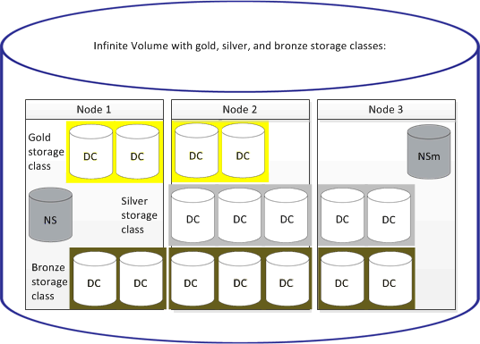

= Was für eine Storage-Klasse
:allow-uri-read: 
:icons: font
:imagesdir: ../media/

[role="lead"]
Eine Storage-Klasse ist eine Definition von Aggregateigenschaften und Volume-Einstellungen. Sie können verschiedene Storage-Klassen definieren und eine oder mehrere Storage-Klassen einem Infinite Volume zuordnen. Sie müssen OnCommand Workflow Automation verwenden, um Workflows für Ihre Anforderungen an die Storage-Klasse zu definieren und Infinite Volumes Storage-Klassen zuzuweisen.

Sie können folgende Merkmale für eine Speicherklasse definieren:

* Aggregatmerkmale, z. B. die zu verwendende Festplattenart
* Volume-Einstellungen wie Komprimierung, Deduplizierung und Volume-Garantie

Sie können beispielsweise eine Storage-Klasse definieren, die nur Aggregate mit SAS Festplatten und den folgenden Volume-Einstellungen verwendet: Thin Provisioning mit aktivierter Komprimierung und Deduplizierung.

Das folgende Diagramm zeigt ein Infinite Volume, das sich über mehrere Nodes erstreckt und folgende Storage-Klassen verwendet: Gold, Silber und Bronze. Jede Storage-Klasse kann zwei oder mehr Nodes innerhalb eines Infinite Volume umfassen. In der Abbildung ist auch die Platzierung von Datenkomponenten in jeder Storage-Klasse dargestellt.

