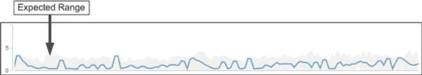

= Wie der erwartete Bereich bei der Leistungsanalyse verwendet wird
:allow-uri-read: 
:icons: font
:imagesdir: ../media/

[role="lead"]
Unified Manager verwendet den erwarteten Bereich, um die typischen Aktivitäten der I/O-Latenz (Reaktionszeit) und der IOPS (Vorgänge) für überwachte Workloads darzustellen. Er benachrichtigt Sie, wenn die tatsächliche Latenz für einen Workload über dem oberen Bereich des erwarteten Bereichs liegt. Dadurch wird ein Performance-Ereignis ausgelöst, sodass Sie das Performance-Problem analysieren und Korrekturmaßnahmen ergreifen können.

Der erwartete Bereich legt die Performance-Baseline für den Workload fest. Im Laufe der Zeit lernt Unified Manager aus früheren Performance-Messungen, um die erwartete Performance und Aktivitätslevel für den Workload zu prognostizieren. Die obere Grenze des erwarteten Bereichs bestimmt den Leistungsschwellenwert. Unified Manager verwendet die Basiskapazität, um zu ermitteln, ob die tatsächliche Latenz oder der tatsächliche Betrieb über einem Schwellenwert oder außerhalb des erwarteten Bereichs liegt. Der Vergleich der ist-Werte mit den erwarteten Werten erstellt ein Performance-Profil für den Workload.

Wenn die tatsächliche Latenz für einen Workload den Performance-Schwellenwert überschreitet, aufgrund von Konflikten bei einer Cluster-Komponente, ist die Latenz hoch, und der Workload arbeitet langsamer als erwartet. Die Performance anderer Workloads, die dieselben Cluster-Komponenten nutzen, ist möglicherweise auch langsamer als erwartet.

Unified Manager analysiert das Schwellenwertüberschreitereignis und legt fest, ob es sich bei der Aktivität um ein Performance-Ereignis handelt. Wenn die hohe Workload-Aktivität über einen langen Zeitraum, z. B. mehrere Stunden, konsistent bleibt, berücksichtigt Unified Manager die Aktivität als „Normal“ und passt den erwarteten Bereich dynamisch an, um den neuen Performance-Schwellenwert zu bilden.

Einige Workloads weisen möglicherweise durchgängig niedrige Aktivitäten auf, bei denen der erwartete Bereich des Betriebs oder der Latenz im Laufe der Zeit keine hohen Änderungsraten aufweisen. Um die Anzahl der Ereignismeldungen zu minimieren, löst Unified Manager während der Analyse von Performance-Ereignissen ein Ereignis nur für Volumes mit niedriger Aktivität aus, deren Vorgänge und Latenzen erheblich höher sind als erwartet.

In diesem Beispiel weist die Latenz für ein Volume einen erwarteten Bereich auf, in Grau, von 0 Millisekunden pro Vorgang (ms/op) bei dem niedrigsten und 5 ms/op bei dem höchsten Wert auf. Wird die tatsächliche Latenz blau auf 10 ms/op plötzlich erhöht, weil der Netzwerk-Traffic oder die Konflikte einer Cluster-Komponente zeitweise zu hoch sind, liegt sie über dem erwarteten Bereich und hat den Performance-Schwellenwert überschritten.

Wenn der Netzwerk-Traffic gesunken ist oder die Cluster-Komponente keine Konflikte mehr aufweist, wird die Latenz innerhalb des erwarteten Bereichs zurückgegeben. Wenn die Latenz für einen langen Zeitraum bei oder über 10 ms/op bleibt, müssen Sie möglicherweise Korrekturmaßnahmen ergreifen, um das Ereignis zu beheben.
