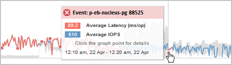

= Performance-Ereignisanalyse und -Benachrichtigung
:allow-uri-read: 
:icons: font
:imagesdir: ../media/

[role="lead"]
Bei Performance-Ereignissen werden Sie über Probleme mit der I/O-Performance bei einem Volume-Workload informiert, die durch Konflikte bei einer Cluster-Komponente verursacht wurden. Unified Manager analysiert das Ereignis, um alle betroffenen Workloads zu ermitteln, die Komponente mit Konflikten zu identifizieren und ob das Ereignis weiterhin ein Problem ist, das Sie möglicherweise beheben müssen.

Unified Manager überwacht die I/O-Latenz (Reaktionszeit) und IOPS (Vorgänge) für Volumes auf einem Cluster. Wenn beispielsweise andere Workloads eine Cluster-Komponente zu hoch nutzen, liegt der Konflikt bei der Komponente und kann nicht auf einer optimalen Ebene Performance erbringen, um die Workload-Anforderungen zu erfüllen. Die Performance anderer Workloads, die dieselbe Komponente verwenden, kann beeinträchtigt werden und die Latenz steigt. Wenn die Latenz den Performance-Schwellenwert überschreitet, löst Unified Manager ein Performance-Ereignis aus und sendet eine E-Mail-Benachrichtigung, um Sie zu benachrichtigen.

== Ereignisanalyse

Unified Manager führt die folgenden Analysen anhand der Performance-Statistiken der letzten 15 Tage durch, um die Opfer-Workloads, problematische Workloads und die an einem Ereignis beteiligte Cluster-Komponente zu identifizieren:

* Identifiziert Opfer-Workloads, deren Latenz den Performance-Schwellenwert überschritten hat; dies ist die obere Grenze des erwarteten Bereichs:
+
** Bei Volumes auf HDD oder Flash Pool (hybride) Aggregaten werden Ereignisse nur ausgelöst, wenn die Latenz mehr als 5 Millisekunden (ms) beträgt und die IOPS mehr als 10 Operationen pro Sekunde (OPs/s) sind.
** Bei Volumes auf reinen SSD-Aggregaten oder FabricPool (Composite)-Aggregaten werden Ereignisse nur ausgelöst, wenn die Latenz größer als 1 ms ist und die IOPS mehr als 100 OPs/s beträgt

* Identifiziert Konflikte bei der Cluster-Komponente.
+
[NOTE]
====
Wenn die Latenz der Opfer-Workloads am Cluster Interconnect größer als 1 ms ist, behandelt Unified Manager dies als erheblich und löst ein Ereignis für den Cluster Interconnect aus.

====
* Ermittelt die problematischer Workloads, die die Cluster-Komponente überbeanspruchen und sie verursachen, dass sie unkonflikte aufweisen.
* Ordnen Sie die betroffenen Workloads auf Grundlage ihrer Umlenkungen in der Auslastung oder Aktivität einer Cluster-Komponente an, um zu ermitteln, welche „Verursacher“ die höchste Nutzungsänderung der Cluster-Komponente aufweisen und welche Opfer am meisten davon betroffen sind.

Ein Ereignis kann nur für einen kurzen Moment eintreten und sich dann selbst korrigieren, nachdem die verwendete Komponente keine Konflikte mehr hat. Ein kontinuierliches Ereignis: Eine erneute Auftreten für dieselbe Cluster-Komponente innerhalb eines Intervalls von fünf Minuten, bleibt im aktiven Status. Für kontinuierliche Ereignisse löst Unified Manager eine Warnmeldung aus, nachdem dasselbe Ereignis in zwei aufeinanderfolgenden Analyseintervallen erkannt wurde. Ereignisse, die ungelöst bleiben, die einen Status von neu haben, können unterschiedliche Beschreibungsmeldungen bei den an der Ereignisänderung beteiligten Workloads anzeigen.

Wenn ein Ereignis gelöst ist, bleibt es in Unified Manager als Teil der Aufzeichnung bisheriger Performance-Probleme für ein Volume verfügbar. Jedes Ereignis verfügt über eine eindeutige ID, mit der der Ereignistyp und die beteiligten Volumes, Cluster und Cluster-Komponenten identifiziert werden.

[NOTE]
====
Ein einzelnes Volume kann gleichzeitig an mehreren Ereignissen beteiligt sein.

====

== Ereignisstatus

Ereignisse können einen der folgenden Status haben:

* * Aktiv*
+
Zeigt an, dass das Leistungsereignis aktuell aktiv ist (neu oder bestätigt). Das Problem, das das Ereignis verursacht hat, wurde nicht selbst behoben oder wurde nicht behoben. Der Performance-Zähler für das Storage-Objekt bleibt über dem Performance-Schwellenwert.

* *Veraltet*
+
Zeigt an, dass das Ereignis nicht mehr aktiv ist. Das Problem, das das Ereignis verursacht hat, hat sich selbst korrigiert oder wurde behoben. Der Performance-Zähler für das Storage-Objekt liegt nicht mehr über dem Performance-Schwellenwert.

== Ereignisbenachrichtigung

Die Ereignisalarme werden auf der Seite Dashboards/Übersicht, Dashboards/Leistung, Performance/Volume Details angezeigt und an angegebene E-Mail-Adressen gesendet. Sie können ausführliche Analyseinformationen zu einem Ereignis anzeigen und auf der Seite „Veranstaltungsdetails“ Vorschläge zu seiner Behebung erhalten.

In diesem Beispiel wird ein Ereignis durch einen roten Punkt ( angezeigtimage:../media/opm-incident-icon-png.gif["Symbol für den Vorfall im Performance Manager"]) Auf der Latenzkarte auf der Seite Performance/Volume Details. Wenn Sie den Mauszeiger über den roten Punkt bewegen, wird ein Popup-Fenster mit weiteren Details zu dem Ereignis und Optionen zur Analyse angezeigt.

== Interaktion mit Ereignissen

Auf der Seite Performance/Volume Details können Sie mit Ereignissen wie folgt interagieren:

* Wenn Sie den Mauszeiger über einen roten Punkt bewegen, wird eine Meldung angezeigt, die die Ereignis-ID zusammen mit der Latenz, der Anzahl der Operationen pro Sekunde und dem Datum und der Zeit, zu der das Ereignis erkannt wurde, anzeigt.
+
Wenn für den gleichen Zeitraum mehrere Ereignisse vorliegen, wird in der Meldung die Anzahl der Ereignisse zusammen mit der durchschnittlichen Latenz und der durchschnittlichen Anzahl von Operationen pro Sekunde für das Volume angezeigt.

* Durch Klicken auf ein einzelnes Ereignis wird ein Dialogfeld angezeigt, das ausführlichere Informationen zu dem Ereignis enthält, einschließlich der involvierten Cluster-Komponenten, ähnlich dem Abschnitt „Zusammenfassung“ auf der Seite „Ereignisdetails“.
+
Die Komponente in Konflikt ist eingekreist und rot hervorgehoben. Sie können entweder auf die Ereignis-ID oder *vollständige Analyse anzeigen* klicken, um die vollständige Analyse auf der Seite Ereignisdetails anzuzeigen. Wenn mehrere Ereignisse für den gleichen Zeitraum vorhanden sind, werden im Dialogfeld Details zu den drei letzten Ereignissen angezeigt. Sie können auf eine Ereignis-ID klicken, um die Ereignisanalyse auf der Seite Ereignisdetails anzuzeigen. Wenn mehr als drei Ereignisse für den gleichen Zeitraum vorhanden sind, wird das Dialogfeld durch Klicken auf den roten Punkt nicht angezeigt.

