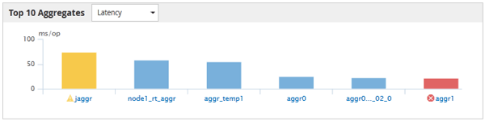

= Seite „Top Performers“
:allow-uri-read: 
:icons: font
:imagesdir: ../media/

[role="lead"]
Auf der Seite „Top Performers“ werden die Speicherobjekte angezeigt, die je nach dem ausgewählten Performance-Zähler die höchste oder niedrigste Performance haben. Beispielsweise können Sie in der Kategorie SVMs die SVMs mit den höchsten IOPS, mit der höchsten Latenz oder mit den niedrigsten MB/s anzeigen. Diese Seite wird auch angezeigt, wenn einer der Top-Performer aktive Performanceereignisse hat (Neu oder bestätigt).

Auf der Seite Top Performers werden maximal 10 Objekte angezeigt. Das Volume-Objekt umfasst sowohl FlexVol Volumes als auch FlexGroup Volumes. Es umfasst keine FlexGroup Komponenten oder Infinite Volumes.

* *Zeitbereich*
+
Sie können einen Zeitbereich für die Anzeige der Top-Performer auswählen. Der ausgewählte Zeitbereich gilt für alle Speicherobjekte. Verfügbare Zeitbereiche:

+
** Letzte Stunde
** Letzte 24 Stunden
** Letzte 72 Stunden (Standard)
** Letzte 7 Tage

* *Metrisch*
+
Klicken Sie auf das Menü *metrisch*, um einen anderen Zähler auszuwählen. Zähleroptionen sind nur dem Objekttyp zugeordnet. Verfügbare Zähler für das Objekt *Volumes* sind beispielsweise *Latenz*, *IOPS* und *Mbps*. Durch Ändern des Zählers werden die Plattendaten basierend auf dem ausgewählten Zähler mit den Top-Performern neu geladen.

+
Verfügbare Zähler:

+
** Latenz
** IOPS
** MB/Sek.
** Verwendete Performance-Kapazität (für Nodes und Aggregate)
** Auslastung (für Nodes und Aggregate)

* * Sortieren*
+
Klicken Sie auf das Menü *Sortieren*, um eine aufsteigende oder absteigende Sortierung für das ausgewählte Objekt und den ausgewählten Zähler auszuwählen. Die Optionen sind *höchste bis niedrigste* und *niedrigste bis höchste*. Bei diesen Optionen werden die Objekte mit höchster Performance oder mit geringster Performance angezeigt.

* *Counter Bar*
+
Der Zählerbalken im Diagramm zeigt die Performance-Statistiken für jedes Objekt an, die als Balken für dieses Objekt dargestellt sind. Die Balkendiagramme sind farbcodiert. Wenn der Zähler keinen Performance-Schwellenwert überschreitet, wird der Zählerbalken in blau angezeigt. Wenn eine Schwellenverletzung aktiv ist (ein neues oder quited Event), wird der Balken in der Farbe für das Ereignis angezeigt: Warnereignisse werden in Gelb ( angezeigtimage:../media/treemapstatus-warning-png.gif["Symbol für TreeMap – Warnstatus"]), und kritische Ereignisse werden in rot (image:../media/treemapred-png.gif["Symbol für TreeMap – Rot"]). Schwellenverletzungen werden zudem durch Symbole für die Schweregrade für Warn- und kritische Ereignisse angezeigt.

+

+
Die X-Achse zeigt für jedes Diagramm die besten Interpreten für den ausgewählten Objekttyp an. Die Y-Achse zeigt die Einheiten an, die für den ausgewählten Zähler gelten. Wenn Sie unter jedem vertikalen Balkendiagramm auf den Objektnamen klicken, werden Sie zur Seite Performance Landing für das ausgewählte Objekt navigieren.

* *Severity Ereignisanzeige*
+
Das Symbol *Severity Event* wird links neben einem Objektnamen für den aktiven kritischen ( angezeigtimage:../media/sev-critical-um60.png["Symbol für den Schweregrad „Ereignis“ – „kritisch“"]) Oder Warnung (image:../media/sev-warning-um60.png["Symbol für den Schweregrad „Ereignis“ – Warnung"]) Ereignisse in den Grafiken der Top-Performer. Klicken Sie zum Anzeigen auf das Symbol * Severity Event*:

+
** *Ein Event*
+
Navigiert zur Seite mit den Veranstaltungsdetails für dieses Ereignis.

** * Zwei oder mehr Veranstaltungen*
+
Navigiert zur Seite „Ereignisbestand“, die gefiltert wird, um alle Ereignisse für das ausgewählte Objekt anzuzeigen.

* *Export-Taste*
+
Erstellt ein `.csv` Datei, die die in der Zählerleiste angezeigten Daten enthält. Sie können die Datei für das einzelne Cluster erstellen, das Sie anzeigen, oder für alle Cluster im Datacenter.

