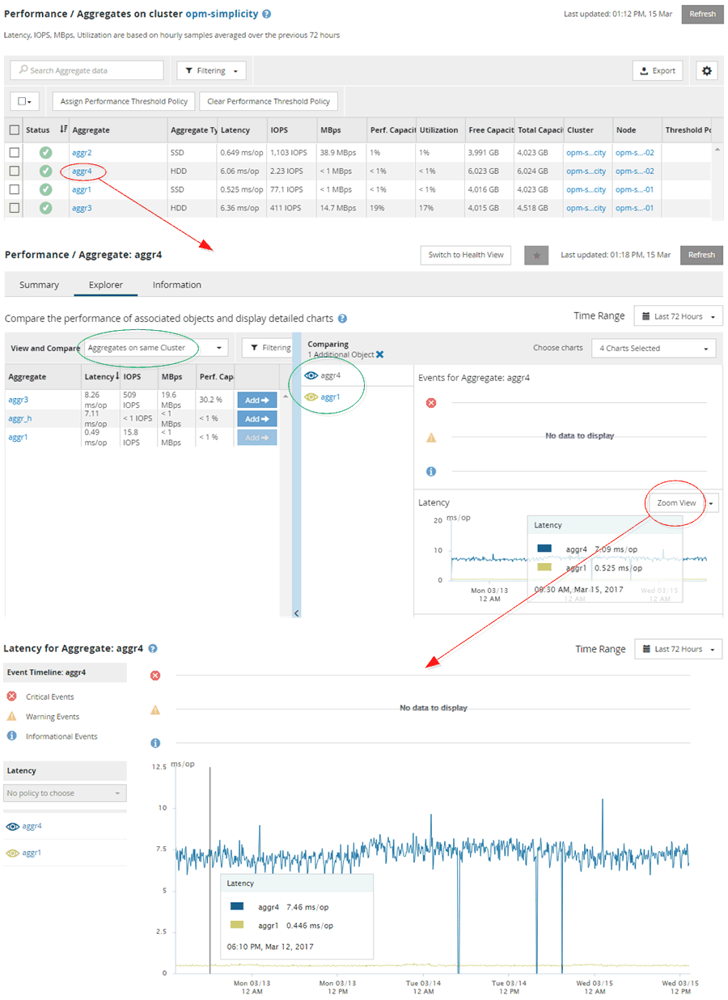

= Monitoring der Navigation zur Cluster-Performance
:allow-uri-read: 
:icons: font
:imagesdir: ../media/

[role="lead"]
Mit Unified Manager lässt sich die Performance aller Cluster überwachen, die von Unified Manager gemanagt werden. Das Monitoring der Cluster bietet einen Überblick über die Cluster- und Objekt-Performance und umfasst das Performance-Ereignis-Monitoring. Sie können sich grundlegende Performance- und Ereignisse anzeigen lassen oder Details zu Cluster- und Objekt-Performance- und Performance-Ereignissen sowie deren Objekt-Performance genauer untersuchen.

Dies ist ein Beispiel für viele mögliche Navigationspfade zur Cluster-Performance:

. Identifizieren Sie auf der Seite Dashboards/Leistung einen Cluster, den Sie untersuchen möchten, und klicken Sie auf *Cluster-Details anzeigen*, um zur Zielseite des ausgewählten Clusters zu navigieren.
. Geben Sie auf der Seite „Performance/Cluster Summary“ den Objekttyp an, den Sie untersuchen möchten, und klicken Sie darauf, um die Seite „Object Inventory“ anzuzeigen.
+
In diesem Beispiel ist *Aggregate* ausgewählt und zeigt die Bestandsseite zu Performance/Aggregaten an.

. Identifizieren Sie auf der Seite „Performance/Aggregate“ das Aggregat, das Sie untersuchen möchten, und klicken Sie auf diesen Aggregatnamen, um zur Seite „Performance/Aggregate Explorer“ zu navigieren.
. Wählen Sie optional im Menü Ansicht und Vergleich weitere Objekte aus, die mit diesem Aggregat verglichen werden sollen, und fügen Sie anschließend dem Vergleichsfenster eines der Objekte hinzu.
+
Statistiken für beide Objekte werden in den Zählerdiagrammen zum Vergleich angezeigt.

. Klicken Sie im Vergleichsanfenster rechts auf der Explorer-Seite auf *Zoom View* in einer der Zählerdiagramme, um Details zum Leistungsverlauf für dieses Aggregat anzuzeigen.

